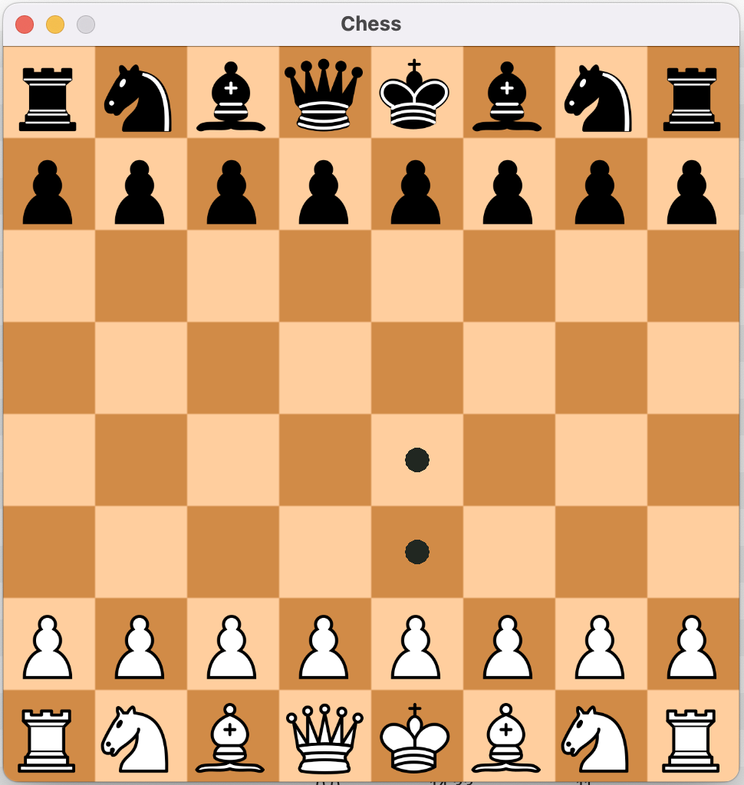
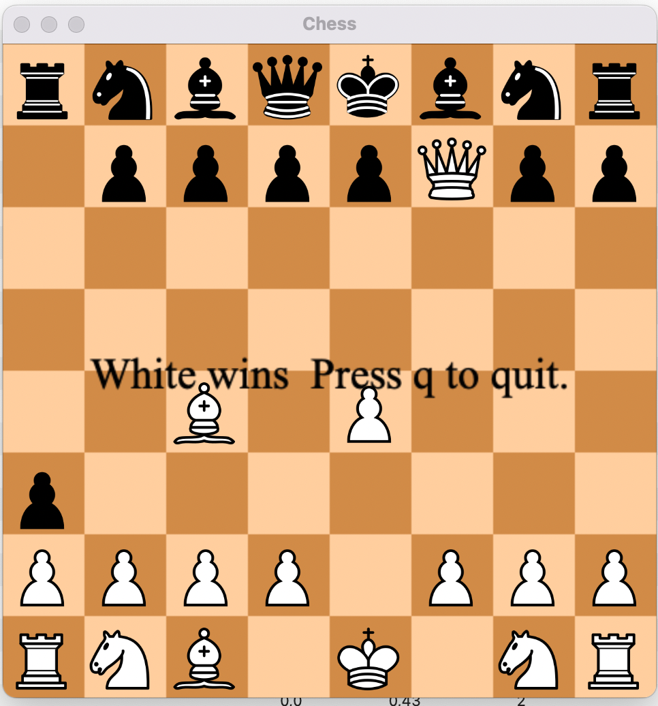

# ChessAI

Attempt to create a decent adversary to play chess against. The game implementation used for the
agents in this project is another personal project
[chess_python](https://github.com/pacanada/chess-python)

Run the (very basic) GUI with:

```cmd
pip install chess-ai-pip
python -m chess_ai.playground.chess_gui
```




## Plan

**Classical engine**:

- [x] Create "decent" agent with alpha beta pruning and minimax
- [x] Implement Move ordering
- [x] Implement transpositions (caching)
- [ ] Implement Iterative deepening search

This classical engine is limited by the performance of the chess game implementation (heavily)

**Deep lerning agent**:

- [ ] 1. Game implementation with legal moves known and value network based on plays of DL agents
- [ ] 2. Learned model, policy and value network

**Evaluation of agent strenght**:

Come up with a simple strength evaluator strategy that can be used to measure progress for the DL
agent and baseline for classical engine agent.

1. Choose an arbitrary number of positions
2. Run them through an engine (stockfish) and rank all posible moves (from best to worst)
3. Compare chosen move from agent to the list of moves from the engine
4. Assign score based on how good is the agent choice, if agent choice is more than one (same
   evaluation for different positions) take the best
5. Sum the score

**UI**

Important for testing TODO:

- [x] Basic UI
- [ ] Play also as black inverting board
- [ ] Allow args when launching the GUI (depth, agent type, fen)
